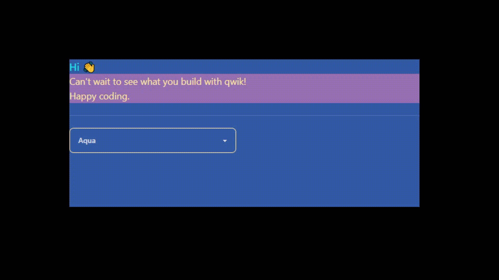
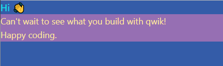
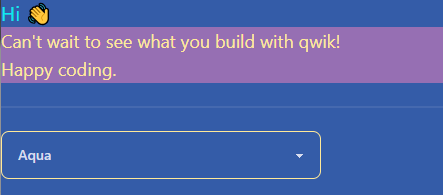
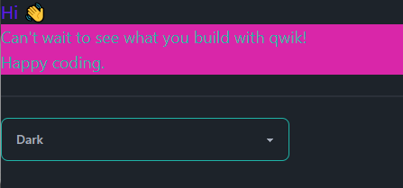
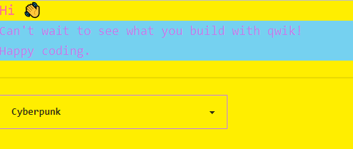

# DaisyUI theme switcher build in qwik

Example of how to integrate [DaisyUI](https://daisyui.com/) in a [Qwik](https://qwik.builder.io/) app and build an simple component to switch between themes.



## Steps

### Install Tailwind qwik integration
DaisyUI uses [Tailwind](https://tailwindcss.com/) behind so we need to integrate tailwind properly into the app.

To do this follow the introduction from [Qwik page for integrations](https://qwik.builder.io/docs/integrations/tailwind/).
```node
npm run qwik add tailwind
```

### Cleanup css
Remove `html` and `body` tag from `global.css` file, but leaf the tailwind stuff.

### Install DaisyUI

Follow the [install](https://daisyui.com/docs/install/) instruction from the website.

### Enable Theme
To use any theme you must enable it in the `tailwind.config.js`. In this case we do not care about performance so we simply enable all themes.

```js
module.exports = {
  //...
  daisyui: {
    themes: true,
  },
}
```

### Set the default theme

In the `root.tsx` file add a [Signal](https://qwik.builder.io/docs/components/state/#usesignal) and use it in the body tag. \
In this example we use `aqua` as the default theme. You find more themes [here](https://daisyui.com/docs/themes/).

```jsx
// ./src/root.tsx
import { component$, useSignal } from "@builder.io/qwik";
...
export default component$(() => {
    const theme = useSignal("aqua"); // <- this is the default theme
    ...

    ...
    <body lang="en" data-theme={theme} class="min-h-screen">
    ... 
```
**Note**: \
The class `min-h-screen` makes the body use the complete height of the screen.

### Start the app
Start the app with `npm run start` and you should see the welcome message with a blue like background.


Great, the default theme works.

### Better look
To see a bit more from the theme you can add some css classes.

```jsx
// src\routes\index.tsx
...
export default component$(() => {
  return (
    <>
      <h1 class="text-xl text-primary">Hi 👋</h1>
      <p class="text-lg text-accent bg-secondary">
        Can't wait to see what you build with qwik!
        <br />
        Happy coding.
      </p>
    </>
  );
});
...
```
Now it is more beautiful. :sparkles:



### Change the theme
Changing the theme is now easy. Just change the value from the signal we defined in the root component.

To do this all you need is a button like this

```jsx
<button class="btn btn-primary" onClick$={()-> theme.value="dark"}>Change Theme</button>
```

But I would like to be able to choose a theme from a list.

The first thing we need is a [Context](https://qwik.builder.io/docs/components/context/). \
This would allow us to change the value of the signal in any component in the app.
```jsx
// ./src/root.tsx
import {
  type Signal,
  component$,
  useSignal,
  createContextId,
} from "@builder.io/qwik";
...

export const ThemeContext = createContextId<Signal<string>>("theme-context"); // <- create the context

export default component$(() => {
...
```

Then use the [ContextProvider](https://qwik.builder.io/docs/components/context/#usecontextprovider) to set the value of the context to the signal
```jsx
// ./src/root.tsx
import {
  ...
  useContextProvider,
} from "@builder.io/qwik";
...
    const theme = useSignal("aqua");
    useContextProvider(ThemeContext, theme); // <- set the signal as value
...
```

We need a component to choose between a list of themes. \
Create a new file `theme-switcher.tsx` inside the routes directory and paste the following content into it.
```jsx
// ./src/routes/theme-switcher.tsx
import { component$, useContext } from "@builder.io/qwik";
import { ThemeContext } from "~/root";

export default component$(() => {
  const themeContext = useContext(ThemeContext);
  return (
    <div class="flex gap-5">
      <select
        onChange$={(e) => (themeContext.value = e.target.value)}
        class="select w-full max-w-xs"
        value={themeContext.value}
      >
        <option value="light">Light</option>
        <option value="dark">Dark</option>
        <option value="aqua">Aqua</option>
        <option value="cyberpunk">Cyberpunk</option>
      </select>
    </div>
  );
});
```

You can add this component anywhere you want. For this example i add it to the `index.tsx`

```jsx
// ./src/routes/index.tsx
import ThemeSwitcher from "./theme-switcher";
...
        Happy coding.
      </p>
      <div class="divider"/> // <- just do separate the theme switcher
      <ThemeSwitcher/> // <- the switcher component
...
```
You should see the theme switcher below other stuff.



Now you are able to switch the themes.




